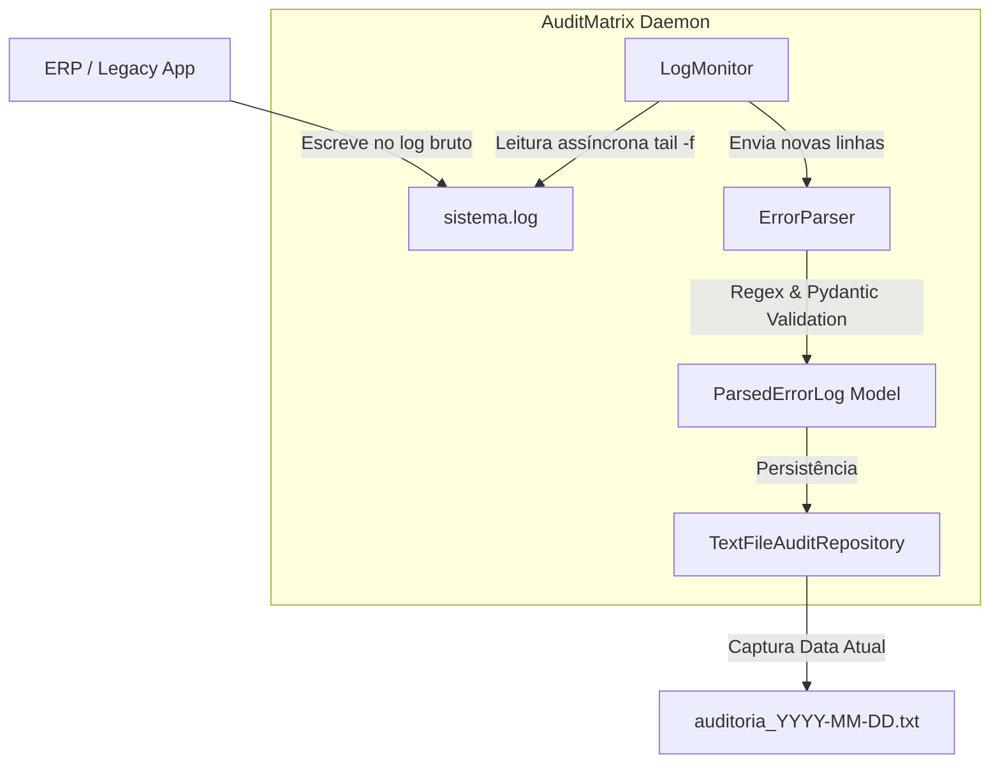

# 🛡️ AuditMatrix: Real-Time Error Log Auditor (Daemon Edition)

O **AuditMatrix** é um serviço de background (**daemon**) de nível empresarial desenvolvido em Python, focado em observabilidade e SRE. Ele monitora continuamente os logs gerados por sistemas ERP e aplicações legadas, filtra ruídos em tempo real e consolida apenas erros críticos em relatórios de auditoria limpos com rotação diária automatizada.

---

## 💡 A Utilidade: Que Problema Resolvemos?

Em ambientes corporativos, diagnosticar erros de ERPs e sistemas legados gera os seguintes gargalos:
1. **Logs Sujos e Ruidosos**: Arquivos de log misturam milhares de linhas de `INFO`, `DEBUG` e exceções complexas, dificultando a localização da falha.
2. **Desperdício de Tempo (MTTR Alto)**: Desenvolvedores e analistas de suporte precisam acessar servidores remotos e ler arquivos gigantescos só para descobrir qual erro ocorreu e em qual tela.
3. **Bloqueios e Concorrência**: No Windows, tentar abrir ou ler arquivos de logs ativos no exato instante em que o ERP escreve neles gera erros de permissão (`PermissionError`).

**Como o AuditMatrix resolve:**
* Ele roda silenciosamente como um daemon (serviço em background), monitorando o log ativo sem carregar o arquivo inteiro na memória.
* Filtra mensagens usando **Regex** de alta performance e valida a integridade com **Pydantic**.
* Consolida os erros capturados em arquivos limpos por dia (ex: `logs/auditoria_2026-06-04.txt`).
* Evita colisões no Windows através de travas de arquivo controladas (`portalocker`) e retentativas automáticas.

---

## 🏗️ Fluxo e Design de Arquitetura

O sistema implementa o **Princípio de Responsabilidade Única (SRP)** e o **Repository Pattern**:



---

## 🚀 Guia Passo a Passo de Uso

### Passo 1: Preparação do Ambiente
Certifique-se de que possui o Python 3.11 ou superior instalado em sua máquina.

1. **Crie e ative o ambiente virtual**:
   ```bash
   # No Windows
   python -m venv .venv
   .venv\Scripts\activate

   # No Linux/macOS
   python3 -m venv .venv
   source .venv/bin/activate
   ```

2. **Instale o projeto e as dependências**:
   ```bash
   pip install .
   ```
   *Se desejar executar os testes automatizados, instale as dependências de desenvolvimento:*
   ```bash
   pip install .[dev]
   ```

---

### Passo 2: Configuração das Variáveis de Ambiente
Duplique o arquivo `.env.example` para `.env` e configure de acordo com a sua infraestrutura:
```bash
copy .env.example .env
```

Configurações disponíveis no `.env`:
* `LOG_SOURCE_PATH`: Caminho do arquivo de logs sujos gerado pelo seu ERP (ex: `logs/sistema.log`).
* `AUDIT_TEXT_PATH`: Diretório base e prefixo onde a auditoria será criada (ex: `logs/auditoria.txt`, que se tornará `logs/auditoria_YYYY-MM-DD.txt`).
* `LOG_PARSER_REGEX`: Expressão regular contendo os grupos de captura nomeados: `timestamp`, `level`, `nome_programa`, `modulo_sistema` e `mensagem_erro`.

---

### Passo 3: Executando o Daemon

Para iniciar o monitoramento de logs em tempo real a partir do final do arquivo:
```bash
python main.py
```

Para processar o arquivo de logs do ERP desde o início (importação histórica):
```bash
python main.py --read-from-start
```

---

### Passo 4: Executando Testes de Validação
Garantimos a confiabilidade do sistema por meio de testes unitários e testes de integração multi-threaded que simulam a ingestão de dados ativos:
```bash
pytest -v
```

---

### Passo 5: Executando via Docker Compose (Produção/Staging)
Você pode rodar o daemon conteinerizado de forma isolada:
```bash
docker-compose up --build -d
```
O container compartilhará os arquivos de logs da sua máquina através de volumes Docker, operando de forma 100% transparente.

---

## 💼 LinkedIn Pitch (Pronto para Postar! 🚀)

Tire um print do terminal rodando o comando `pytest -v` ou do arquivo `auditoria_YYYY-MM-DD.txt` populado e use a publicação abaixo para compartilhar no LinkedIn:

***

**💡 Automação de Observabilidade e Cultura SRE: Reduzindo o MTTR com Auditoria de Logs em Tempo Real** 🛡️⚙️

Em sistemas corporativos e ERPs legados, debugar falhas costuma ser sinônimo de acessar servidores remotos de forma reativa e garimpar arquivos de logs gigantescos e cheios de ruído. 

Para resolver essa dor de forma profissional, desenvolvi o **AuditMatrix**: um serviço de background (**Daemon**) resiliente projetado com práticas modernas de desenvolvimento de software em Python.

**O que a solução resolve na prática?**
* **Escuta Ativa (Native tail -f)**: Monitora de forma assíncrona o log sujo do ERP. Ele consome novas linhas sob demanda, garantindo consumo de memória RAM próximo a zero mesmo em arquivos de múltiplos gigabytes.
* **Validação de Schemas com Pydantic**: Transforma linhas de erro confusas em estruturas de dados tipadas e consistentes, aplicando expressões regulares robustas.
* **Rotação Diária Automatizada**: O daemon separa automaticamente os logs limpos por data (ex: `logs/auditoria_2026-06-04.txt`), facilitando o diagnóstico rápido pelo time de suporte.
* **Resiliência a Rotações**: Se o sistema original truncar ou limpar o arquivo de log monitorado (`logrotate`), o daemon detecta a alteração no disco em tempo real e reseta o ponteiro sem travar.
* **Prevenção de PermissionError**: Em ambientes Windows de alta concorrência, implementei file locks (`portalocker`) e estratégias de retentativa para evitar conflitos de leitura/escrita.

Aplicações modernas exigem arquiteturas resilientes que evitam o crash silencioso. O projeto está 100% dockerizado e coberto por testes automatizados (`pytest`).

Confira o repositório completo e os testes passando! 👇
[Inserir link do seu repositório Git]

#Python #SRE #Observability #CleanArchitecture #Docker #DevOps #Backend #SoftwareEngineering
