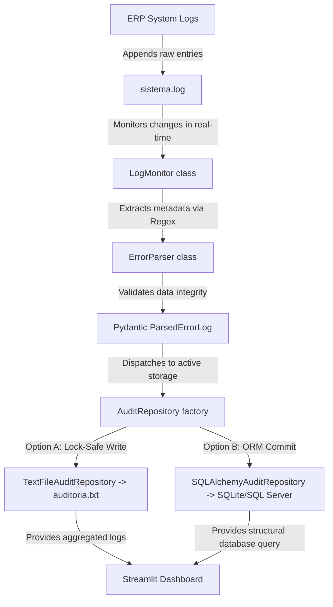

# 🛡️ AuditMatrix: Real-Time Error Log Auditor & Analytics

An enterprise-grade, real-time log monitoring and auditing system. Designed with Clean Architecture principles, strict static typing, and separation of concerns.

---

## 🏗️ Architecture & Design Patterns

AuditMatrix processes raw log files from legacy systems or ERPs, filters noise, validates structural requirements, and provides real-time audit visualization.

### Architecture Diagram


### Key Design Patterns Implemented
1. **Single Responsibility Principle (SRP)**:
   - `parser.py` only extracts raw strings using regex.
   - `repository.py` only manages data persistence.
   - `monitor.py` only tracks file pointer offsets and triggers the processing pipeline.
2. **Repository Pattern & Dependency Injection**:
   - The persistence layer is completely decoupled. Toggling from local text files to SQLite or Microsoft SQL Server requires only an environment flag change, without modifying application logic.
3. **Concurrency-Safe File Handling**:
   - Includes retry loops and read-write sharing flags (`portalocker`) to avoid `PermissionError` blockages under high-concurrency environments on Windows.

---

## 🛠️ Tech Stack & Requirements

- **Base**: Python 3.11+
- **Data Validation**: Pydantic v2
- **Database Abstraction**: SQLAlchemy 2.0 (Core & ORM)
- **Visual Interface**: Streamlit & Plotly
- **Quality Assurance**: Pytest (Unit and Integration testing), Ruff (Linting)
- **Containerization**: Docker & Docker Compose

---

## 🚀 Getting Started

### Local Setup (Python)

1. **Clone & Setup Virtualenv**:
   ```bash
   python -m venv .venv
   .venv\Scripts\activate     # On Windows
   source .venv/bin/activate  # On Linux/macOS
   ```

2. **Install Dependencies**:
   ```bash
   pip install .
   # Install dev tools if you want to run tests
   pip install .[dev]
   ```

3. **Configure Environment**:
   Duplicate `.env.example` to `.env` and adjust variables if needed:
   ```bash
   copy .env.example .env
   ```

4. **Run the Monitor Service**:
   ```bash
   python main.py --read-from-start
   ```

5. **Run the Dashboard**:
   ```bash
   streamlit run dashboard.py
   ```

---

### Running via Docker Compose (Recommended)

Start the entire stack (Database, Monitor Service, and Streamlit Dashboard) with a single command:
```bash
docker-compose up --build -d
```
Access the dashboard at [http://localhost:8501](http://localhost:8501).

---

## 🧪 Testing

We implement isolated unit testing for parsers and database repositories, alongside multi-threaded integration testing for the active tailing monitor.

Run the test suite:
```bash
pytest -v
```

---

## 💼 LinkedIn Pitch (Como vender seu peixe)

Tire um print do terminal executando o monitor e da tela do dashboard do Streamlit, e use o texto abaixo para postar:

> **Automação de Observabilidade e Cultura SRE: Reduzindo MTTR com Monitoramento de Logs Real-time** 🛠️📊
>
> Desenvolvi o **AuditMatrix**, uma solução de monitoramento de logs locais focada em infraestrutura resiliente e cultura DevOps para suporte técnico avançado.
>
> **O que o projeto faz?**
> Monitora de forma contínua e assíncrona (`tail -f` nativo) os logs complexos gerados pelo ERP original da empresa. O script captura exceções em milissegundos utilizando Expressões Regulares (Regex), valida a consistência de dados via **Pydantic** e consolida tudo de forma estruturada.
>
> **Destaques técnicos de Arquitetura Sênior:**
> 1. **Repository Pattern**: Abstração total de banco de dados (SQLAlchemy) e arquivos planos (.txt), permitindo alternar de arquivos locais para SQL Server via simples variável de ambiente.
> 2. **Resiliência e Concorrência**: Lógica de retries e locking seguro contra bloqueios de arquivos no Windows (evitando falhas quando o ERP escreve concorrentemente).
> 3. **Interface Visual Premium**: Painel analítico construído com **Streamlit** e **Plotly** para análise rápida de erros mais frequentes e filtros de busca instantâneos.
> 4. **Testes de Ingestão**: Cobertura completa de testes automatizados com **Pytest** utilizando threads em background para validar a escuta ativa de arquivos.
>
> Uma arquitetura limpa, dockerizada e pronta para produção que transforma logs sujos em relatórios limpos de auditoria para o time de suporte e suporte N3 resolver incidentes muito mais rápido.
